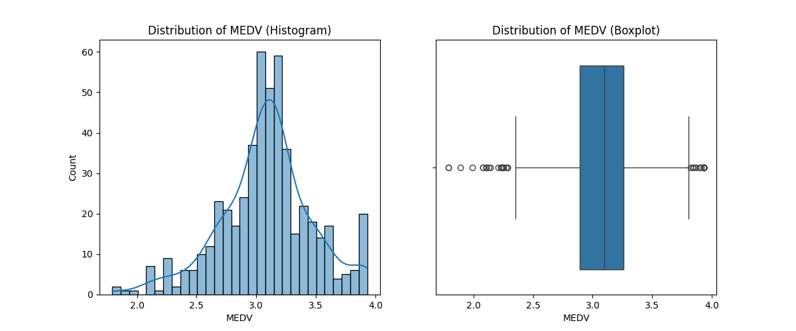
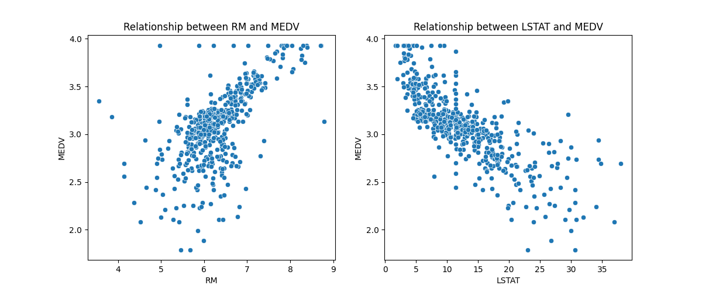
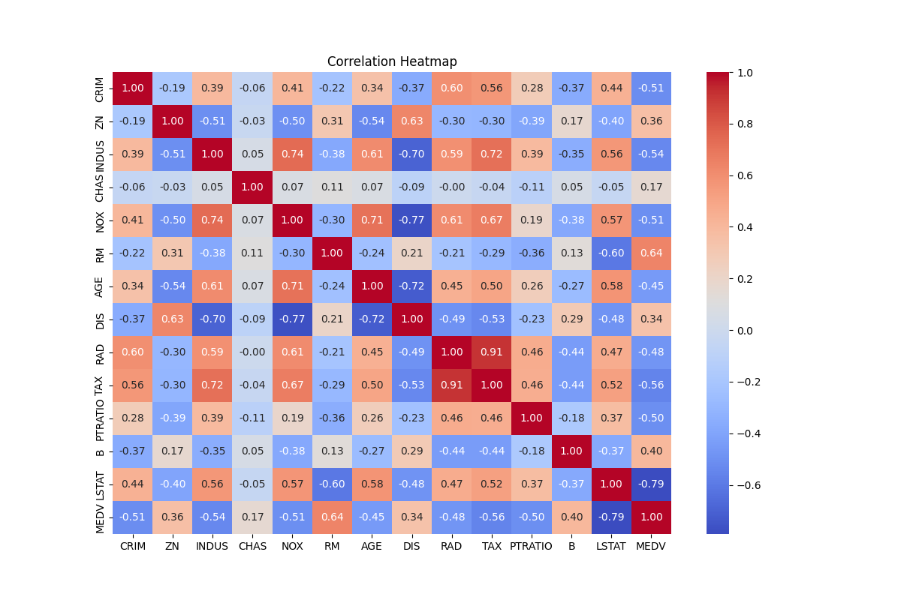
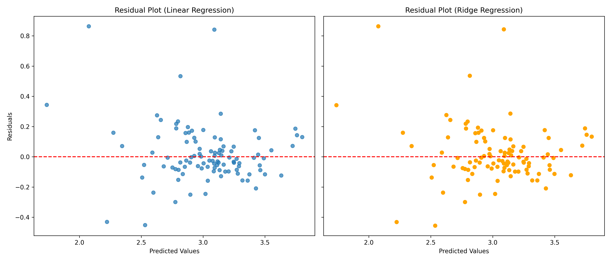

# Assumption 
1. Linearity: The relationship between predictors and the target variable is assumed to be linear.
2. Independence: Observations are independent of one another, and no autocorrelation is assumed.
3. Homoscedasticity: The residuals have constant variance across all levels of predicted values.
4. Normality of Residuals: Residuals are approximately normally distributed.
5. Outliers: The target variable MEDV was highly skewed and contained significant outliers. While the assignment specified capping values at the 95th percentile, I also applied a log transformation (MEDV_log) to stabilize variance and approximate normality. This helps the model better satisfy linear regression assumptions. Coefficient interpretations are therefore in log scale, meaning they represent percentage changes in median home value rather than absolute changes. This transformation was chosen after examining the distribution and skewness of MEDV as an aplication of best practices which is not explicitly required in the assignment however taught in the last module as well as in real-world data science projects.
6. Handling Skewness: Several predictors exhibited right skewness; these were log-transformed to approximate normality.
7. Missing Data: Missing values were imputed using the median, since the distributions were skewed and the median is more robust to outliers than the mean.

# Regression Model Analysis Report

## a) Model Selection
Based on the comparison table, both **Linear Regression** and **Ridge Regression** achieved very similar performance:

- **Linear Regression:** R² = 0.7420, RMSE = 0.1892  
- **Ridge Regression:** R² = 0.7413, RMSE = 0.1894  

Since Ridge regularization did not provide a noticeable improvement, the simpler Linear Regression model is preferable. 
Ridge regularization did not provide a significant improvement. Both models explain ~74% of variance with very similar errors. 

## b) Assumption Interpretation
The residual plot shows residuals scattered around zero, suggesting no major non-linear patterns.
Some heteroscedasticity may still exist, but overall the model assumptions are reasonably satisfied.  
An ideal residual plot should look like random noise around zero with constant variance.

## c) Coefficient Interpretation
- **Largest Positive Coefficient:** RM = 0.080  
  → For every one-unit increase in RM, the median home value is expected to increase by 0.080, holding other features constant.  

- **Largest Negative Coefficient:** LSTAT = -0.163  
  → For every one-unit increase in LSTAT, the median home value is expected to decrease by -0.163, holding other features constant.

## Files produced:
1. 
2. 
3. 
4. 
5. [model_performance_comparison.csv](model_performance_comparison.csv)

